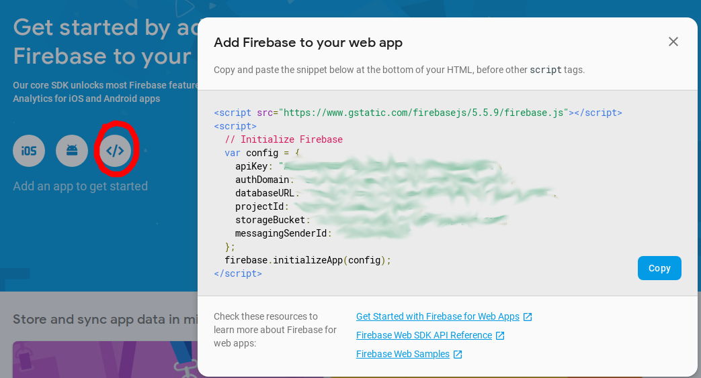
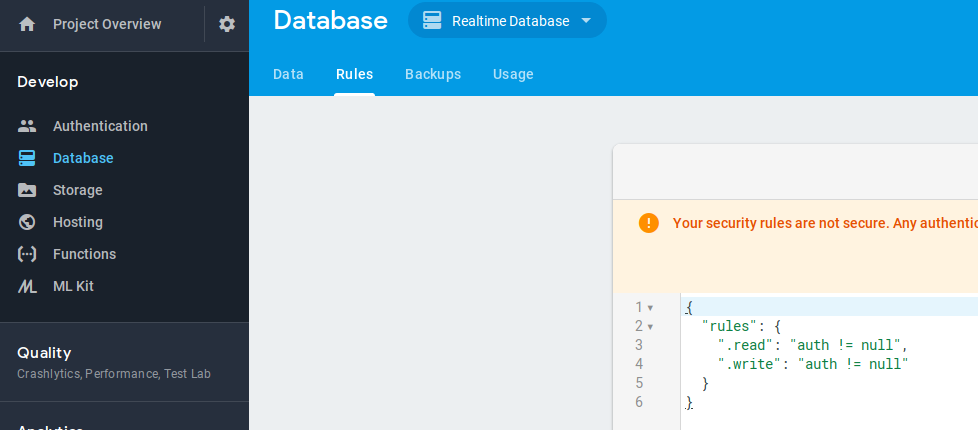

# edx_xblock_firechat

Installation
------------

Install package

    pip install -e git+https://github.com/raccoongang/edx_xblock_firechat.git#egg=edx_xblock_firechat

Add `firechat` to the list of advanced modules in the advanced settings of a course.

## Firebase credentials
1. Go to https://console.firebase.google.com/project
2. Select existing or create new project
3. Get the firebase credentials:

4. Create database
5. Select "Realtime Database" and change rules:

```JSON
{
  "rules": {
    ".read": "auth != null",
    ".write": "auth != null"
  }
}
```

